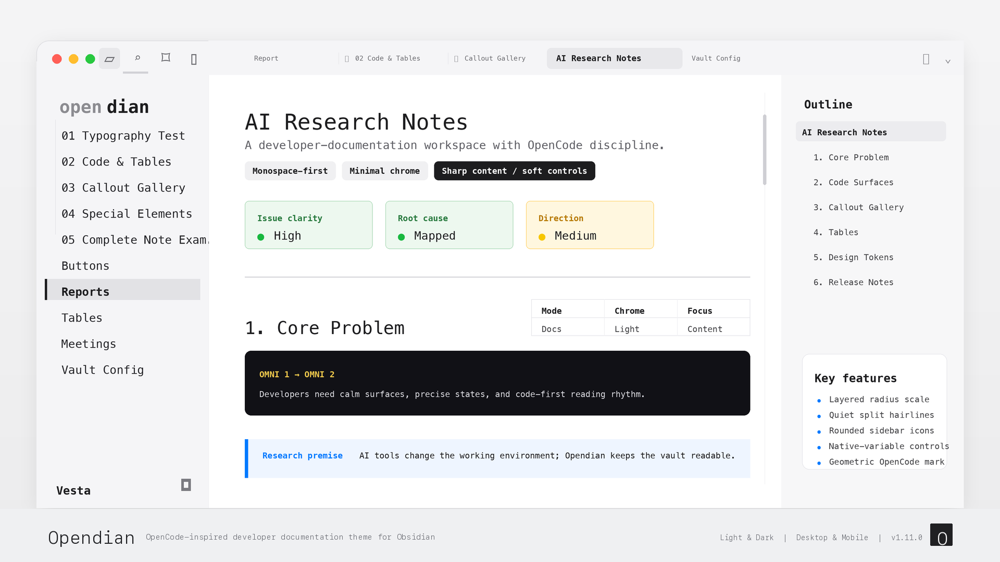

# Opendian



> **一款为 Obsidian 打造的开发者文档主题。** 等宽字体、分层圆角标尺、极简线条——以 [OpenCode](https://opencode.ai) 官方视觉语言为灵感，让你的知识库拥有专业代码编辑器的质感，而非笔记应用的观感。

[English](https://github.com/elijahchan2019/obsidian-opendian-theme/blob/main/README.md) · 亮色 &amp; 暗色 · 桌面 &amp; 移动端 · 无需插件

## 为什么选择 Opendian

- **等宽字体优先** —— IBM Plex Mono → Berkeley Mono → JetBrains Mono 横跨标题、正文与界面。你的知识库读起来像终端输出和技术文档。
- **分层圆角标尺** —— 内容保持锋利（代码块、表格、callout 为 0px），控件柔和（按钮、输入框、页签为 4–8px），弹窗更柔（12px）。一条连贯的原则，而非随意的圆角。
- **极简线条** —— 用背景层级替代生硬的 1px 边框。页签栏、标题栏、视图头部融为一体的沉浸式表面。
- **OpenCode 色彩系统** —— 精确的色彩 token，源自 OpenCode 官网和桌面客户端。`#007AFF` 强调色、单色主要操作、语义化 Callout 配色。
- **平面活跃页签** —— 非活跃页签是带有极细分隔线的素文本；活跃页签是一块安静的浅色 chip，并保持侧边栏原生对齐。
- **终端级代码块** —— 柔和填充面配合语言标签。没有伪 macOS 窗口按钮、复制按钮 chrome 或阴影。
- **语义化 Callout** —— 左侧 3px 强调条 + 带透明度的底色，还原 OpenCode 文档旁注风格。Info、Warning、Success、Danger 各有独立配色。
- **IDE 风格侧边栏** —— 活跃文件使用黑色强调条，顶部工具栏悬停自动折叠（Folio 风格），库名使用双色 wordmark。

## 设计

Opendian 建立在 OpenCode 色彩系统之上——一套精确的、以单色为主导、配以单一蓝色强调的配色方案：

**亮色模式（文档风格）：**

| 色彩 | 值 | 用途 |
| --- | --- | --- |
| 背景 | `#FFFFFF` | 主要书写面 |
| 表面 | `#F5F5F7` | 侧边栏、非活跃页签、次要区域 |
| 边框 | `#D2D2D7` | 分隔线、1px 线条 |
| 主文本 | `#1D1D1F` | 正文与标题 |
| 强调 | `#007AFF` | 链接 |

**暗色模式（终端风格）：**

| 色彩 | 值 | 用途 |
| --- | --- | --- |
| 背景 | `#0C0C0E` | 主要表面 |
| 表面 | `#161618` | 侧边栏、非活跃页签 |
| 边框 | `#38383A` | 分隔线 |
| 主文本 | `#FFFFFF` | 正文 |
| 强调 | `#007AFF` | 链接 |

排版使用等宽字体优先的字体栈，配合中日韩回退：

- **标题与正文：** IBM Plex Mono、Berkeley Mono、JetBrains Mono、SF Mono → 思源黑体 SC
- **界面：** 同一等宽字体栈 → 苹方 SC
- **代码：** 同一等宽字体栈（无需回退）

### 圆角分层标尺

| 层级 | 值 | 适用范围 |
| --- | --- | --- |
| 内容 | `0px` | 代码块、表格、Callout、引用块 |
| 小标签 | `4px` | Tag、菜单项、建议行 |
| 控件 | `6px` | 按钮、输入框、下拉框、页签 |
| 浮层 | `8px` | 右键菜单、命令面板、工具提示 |
| 弹窗 | `12px` | 设置窗口与对话框 |

## Opendian 覆盖了哪些界面

Opendian 覆盖了塑造开发者写作体验的每一个表面：

- **代码块** —— 柔和填充面配合语言标签头；无装饰性圆点、复制按钮 chrome 或阴影
- **行内代码** —— 无边框底色 + 强调色文字
- **Callout** —— 左侧 3px 强调条 + 8–10% 透明度底色，还原 OpenCode 文档风格
- **表格** —— 极简 1px 水平细线、零圆角、紧凑密度
- **引用块** —— 单一中性竖线，无强调色溢出
- **标题** —— 等宽字体、无装饰下划线、编辑/阅读模式字号一致
- **页签** —— 沉浸式顶栏 + 平面活跃 chip、极细分隔线、几何图钉标记
- **侧边栏** —— 活跃文件黑色强调条、顶部工具栏悬停自动折叠
- **库名 wordmark** —— 双色文字标题，不再使用硬编码首字母头像框
- **按钮** —— 纯黑/白主按钮、描边次要按钮、6px 圆角
- **开关** —— 圆角矩形（5px 轨道、3px 滑块），而非药丸形
- **复选框** —— 单色填充、已完成任务仅淡化而非删除线
- **下拉框** —— 无边框 + `field-sizing: content` 按值宽度自适应

## 安装

从 Obsidian 社区主题市场安装：

1. 打开 **设置 → 外观 → 主题 → 管理**
2. 搜索 **Opendian**
3. 安装并启用主题

也可以手动安装：下载最新 release 中的 `theme.css` 和 `manifest.json`，并放入：

```text
<vault>/.obsidian/themes/Opendian/
```

## 兼容性

- Obsidian 1.4.0+
- 支持亮色与暗色模式
- 支持桌面端与移动端
- 不依赖插件

## 许可证

[MIT](LICENSE)
